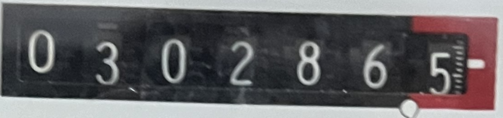

# Energy Meter Reader

This Python script extracts information from images of energy meters, focusing on reading and extracting the meter number. It uses the `easyocr` library for optical character recognition (OCR) and processes image files in the specified folder.

## Prerequisites

Make sure to install the required libraries before running the script. You can install them using:

'pip install easyocr Pillow'

## Usage

1. Adjust the `folder_path` and `csv_file_path` in the `Variables.py` file to specify the image folder and CSV file path, respectively.

2. Ensure your images are in the specified folder and are in formats like `.png`, `.jpg`, or `.jpeg`.

3. Run the script:

The script extracts the date from image metadata, performs OCR on the images, and writes the results to a CSV file. Meter numbers are obtained by extracting digits from the OCR result.

## Example

The script processes images like `20240118_small.png`, representing the appearance of the energy meter.

## Note

Ensure OCR results are accurate. If you encounter issues, check the `easyocr` documentation for parameters and configurations to fine-tune recognition.

